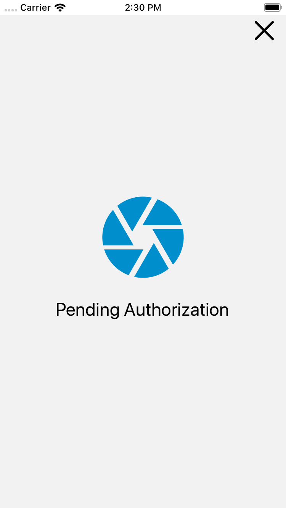

# Example App

### Create a new application

Run the following commands from your terminal

```bash
$ npx react-native init ReactNativeCamera
$ cd ReactNativeCamera
$ npx react-native start
$ npx react-native run-ios
```

### Install and link dependencies

[React Native Camera](https://react-native-community.github.io/react-native-camera/docs/installation)

```bash
$ npm install react-native-camera --save
$ cd ios && pod install && cd ..
```

### iOS required steps

Add permissions with usage descriptions to your app's Info.plist

`ios/ReactNativeCameraBoilerplage/Info.plis`

```markup
<!-- Required with iOS 10 and higher -->
<key>NSCameraUsageDescription</key>
<string>Your message to user when the camera is accessed for the first time</string>

<!-- Required with iOS 11 and higher: include this only if you are planning to use the camera roll -->
<key>NSPhotoLibraryAddUsageDescription</key>
<string>Your message to user when the photo library is accessed for the first time</string>

<!-- Include this only if you are planning to use the camera roll -->
<key>NSPhotoLibraryUsageDescription</key>
<string>Your message to user when the photo library is accessed for the first time</string>

<!-- Include this only if you are planning to use the microphone for video recording -->
<key>NSMicrophoneUsageDescription</key>
<string>Your message to user when the microphone is accessed for the first time</string>
```

### Android required steps

Add permissions to your AndroidManifest.xml file

`android/app/src/main/AndroidManifest.xml`

```markup
<!-- Required -->
<uses-permission android:name="android.permission.CAMERA" />

<!-- Include this only if you are planning to use the camera roll -->
<uses-permission android:name="android.permission.READ_EXTERNAL_STORAGE" />
<uses-permission android:name="android.permission.WRITE_EXTERNAL_STORAGE" />

<!-- Include this only if you are planning to use the microphone for video recording -->
<uses-permission android:name="android.permission.RECORD_AUDIO"/>
```


Make sure to shut down your app and run it again so the changes are applied


### Coding time

Let's start by creating our directory structure. Once you are done creating the directories your project should look like this.

```bash
├── ReactNativeCameraBoilerplate
       ├── src
       │   ├── containers
       │   ├── components
       │   ├── theme
       └── index.js
```

Now create a **camera container** component and a root container component

```bash
$ touch src/containers/CameraScreen.js
$ touch src/containers/RootContainer.js
```

Create a **camera component**. React Native allows to write really modular code with components as the driving force allowing you to reuse code easily.

```bash
$ mkdir src/components/Camera
$ touch src/components/Camera/Camera.js
```

Edit the **Camera.js** component. The finished result should look similar to this, a functional component that can be imported into any screens that need it.

```jsx
// src/component/Camera/Camera.js
import React from 'react';
import {StyleSheet} from 'react-native';
import {RNCamera} from 'react-native-camera';

const Camera = ({children, cameraRef, whiteBalanceMode, flashMode, zoom}) => {
  return (
    <RNCamera
      ref={cameraRef}
      style={styles.container}
      flashMode={flashMode}
      whiteBalance={whiteBalanceMode}
      captureAudio={false}
      zoom={zoom}>
      {children}
    </RNCamera>
  );
};

const styles = StyleSheet.create({
  container: {
    flex: 1,
  },
});

export default Camera;
```

### Install prop-types

The[ prop-types](https://github.com/facebook/prop-types) library will help us reduce errors once we deploy this app to the app/play store. We get runtime type checking for React props. React will check props passed to our camera component against   the prop type definitions set, and warn in development if they don't match.

```bash
$ npm install prop-types
```

Once install update Camera.js to look like the following. Notice that we are also setting the default props which are the default unless the parent overrides them.

```jsx
// src/component/Camera/Camera.js
import React from 'react';
import {StyleSheet} from 'react-native';
import {RNCamera} from 'react-native-camera';
import PropTypes from 'prop-types';

const Camera = ({children, cameraRef, whiteBalanceMode, flashMode, zoom}) => {
  return (
    <RNCamera
      ref={cameraRef}
      style={styles.container}
      flashMode={flashMode}
      whiteBalance={whiteBalanceMode}
      captureAudio={false}
      zoom={zoom}>
      {children}
    </RNCamera>
  );
};

const styles = StyleSheet.create({
  container: {
    flex: 1,
  },
});

Camera.defaultProps = {
  children: null,
  cameraRef: () => null,
  whiteBalanceMode: RNCamera.Constants.WhiteBalance.auto,
  flashMode: RNCamera.Constants.FlashMode.auto,
  zoom: 0,
};

Camera.propTypes = {
  children: PropTypes.node,
  cameraRef: PropTypes.fuc,
  whiteBalanceMode: PropTypes.string,
  flashMode: PropTypes.string,
  zoom: PropTypes.number,
};

export default Camera;

```

Edit the camera container and import our camera component

```jsx
// src/containers/CameraScreen.js
import React, {Component} from 'react';
import {View, Text} from 'react-native';

import Camera from '../components/Camera/Camera';

export default class CameraScreen extends Component {
  constructor(props) {
    super(props);
    this.state = {};
  }

  render() {
    return (
      <View>
        <Camera />
      </View>
    );
  }
}
```

### Build the camera layout

Install **@nartc/react-native-barcode-mask** and ****it's dependency **react-native-reanimated** to get us a nice viewfinder so we don't have to build one from scratch. Also import SafeAreaView from React Native so we can handle iPhoneX notches.

```bash
$ npm install @nartc/react-native-barcode-mask
$ npm install react-native-reanimated
$ cd ios && pod install && cd ..
```

Here is the updated code. Also don't forget to recompile your app after linking native modules.

```jsx
// src/containers/CameraScreen.js
import React, {Component} from 'react';
import {SafeAreaView, StyleSheet} from 'react-native';

import Camera from '../components/Camera/Camera';
import {BarcodeMask} from '@nartc/react-native-barcode-mask';

export default class CameraScreen extends Component {
  constructor(props) {
    super(props);
    this.state = {};
  }

  render() {
    return (
      <SafeAreaView style={styles.container}>
        <Camera>
          <BarcodeMask />
        </Camera>
      </SafeAreaView>
    );
  }
}

const styles = StyleSheet.create({
  container: {
    flex: 1,
  },
});

```

### Display a camera in our app

Start by editing **RootContainer.js** and import **CameraScreen.js**

```jsx
// src/containers/RootContainer.js
import React from 'react';
import CameraScreen from './CameraScreen';

const RootComponent = () => <CameraScreen />;

export default RootComponent;
```

Now let's update **App.js** to display the camera. Start by removing everything already there and replace it with the following.

```jsx
/**
 * ReactNativeCameraBoilerplate
 * https://github.com/jqn/reactNativeCameraBoilerplate
 * App.js
 */

import React from 'react';
import {StatusBar} from 'react-native';
import RootContainer from './src/containers/RootContainer';

const App = () => {
  return (
    <>
      <StatusBar barStyle="dark-content" />
      <RootContainer />
    </>
  );
};

export default App;

```

### Build nicer auth error and auth pending views for the camera

Install **react-native-vector-icons**

```bash
$ npm install --save react-native-vector-icons
$ cd ios && pod install && cd ..
```

Edit `Info.plist` and add a property called **Fonts provided by application** \(or `UIAppFonts`\) to XCode.

```markup
<?xml version="1.0" encoding="UTF-8"?>
<!DOCTYPE plist PUBLIC "-//Apple//DTD PLIST 1.0//EN" "http://www.apple.com/DTDs/PropertyList-1.0.dtd">
<plist version="1.0">
<dict>
	<key>CFBundleDevelopmentRegion</key>
	<string>en</string>
	<key>CFBundleDisplayName</key>
	<string>ReactNativeCameraBoilerPlate</string>
	<key>CFBundleExecutable</key>
	<string>$(EXECUTABLE_NAME)</string>
	<key>CFBundleIdentifier</key>
	<string>$(PRODUCT_BUNDLE_IDENTIFIER)</string>
	<key>CFBundleInfoDictionaryVersion</key>
	<string>6.0</string>
	<key>CFBundleName</key>
	<string>$(PRODUCT_NAME)</string>
	<key>CFBundlePackageType</key>
	<string>APPL</string>
	<key>CFBundleShortVersionString</key>
	<string>1.0</string>
	<key>CFBundleSignature</key>
	<string>????</string>
	<key>CFBundleVersion</key>
	<string>1</string>
	<key>LSRequiresIPhoneOS</key>
	<true/>
	<key>NSAppTransportSecurity</key>
	<dict>
		<key>NSAllowsArbitraryLoads</key>
		<true/>
		<key>NSExceptionDomains</key>
		<dict>
			<key>localhost</key>
			<dict>
				<key>NSExceptionAllowsInsecureHTTPLoads</key>
				<true/>
			</dict>
		</dict>
	</dict>
	<key>NSLocationWhenInUseUsageDescription</key>
	<string></string>
	<key>UILaunchStoryboardName</key>
	<string>LaunchScreen</string>
	<key>UIRequiredDeviceCapabilities</key>
	<array>
		<string>armv7</string>
	</array>
	<key>UISupportedInterfaceOrientations</key>
	<array>
		<string>UIInterfaceOrientationPortrait</string>
		<string>UIInterfaceOrientationLandscapeLeft</string>
		<string>UIInterfaceOrientationLandscapeRight</string>
	</array>
	<key>UIViewControllerBasedStatusBarAppearance</key>
	<false/>
	<key>UIAppFonts</key>
	<array>
		<string>AntDesign.ttf</string>
		<string>Entypo.ttf</string>
		<string>EvilIcons.ttf</string>
		<string>Feather.ttf</string>
		<string>FontAwesome.ttf</string>
		<string>FontAwesome5_Brands.ttf</string>
		<string>FontAwesome5_Regular.ttf</string>
		<string>FontAwesome5_Solid.ttf</string>
		<string>Foundation.ttf</string>
		<string>Ionicons.ttf</string>
		<string>MaterialCommunityIcons.ttf</string>
		<string>MaterialIcons.ttf</string>
		<string>Octicons.ttf</string>
		<string>SimpleLineIcons.ttf</string>
		<string>Zocial.ttf</string>
	</array>
</dict>
</plist>

```

Use [IconFinder](https://www.iconfinder.com/) to generate or find a nice icon for the not authorized camera view

Create a new directory to keep our images in `src/images`  and download a png from icon finder. [IconFinder](https://www.iconfinder.com/) allows you to download any of their icons in three sizes. Save them as:

```markup
no_cam_auth.png // 128 X 128
no_cam_auth@2x.png // 256 X 256
no_cam_auth@3x.png // 512 X 512
```

Create two new components in `src/components/Camera`

```bash
$ touch src/components/Camera/NotAuthView.js
$ touch src/components/Camera/PendingAuthView.js
```

Edit the not authorized view component and style it. We are using PropTypes and  variables to make our view as reusable as possible.

```jsx
// src/components/Camera/NotAuthView.js
import React from 'react';
import {Image, StyleSheet, Text, View} from 'react-native';
import AntDesign from 'react-native-vector-icons/AntDesign';
import PropTypes from 'prop-types';

const NotAuthView = ({onClosePress, message}) => (
  <View style={styles.container}>
    <View style={styles.header}>
      <AntDesign
        name="close"
        backgroundColor="#FFF"
        color="#000"
        size={40}
        onPress={onClosePress}
        style={styles.icon}
      />
    </View>
    <View style={styles.section}>
      <Text style={styles.bodyText}>{message}</Text>
      <Image
        source={require('../../images/no_cam_auth.png')}
        style={styles.image}
      />
    </View>
    <View style={styles.footer} />
  </View>
);

const styles = StyleSheet.create({
  container: {
    flex: 1,
    backgroundColor: '#FFF',
  },
  header: {
    flexDirection: 'row',
    justifyContent: 'flex-end',
  },
  section: {
    flex: 1,
    justifyContent: 'center',
    alignItems: 'center',
  },
  icon: {
    alignSelf: 'center',
    marginHorizontal: 8,
  },
  image: {
    margin: 16,
  },
  bodyText: {
    fontFamily: 'System',
    fontSize: 24,
  },
  footer: {
    flex: 0.15,
  },
});

NotAuthView.defaultProps = {
  message: 'Camera Not Authorized',
  onClosePress: () => {},
};

NotAuthView.propTypes = {
  message: PropTypes.string,
  onClosePress: PropTypes.func,
};

export default NotAuthView;
```


Similarly here is the pending auth view.

```jsx
// src/components/Camera/PendingAuthView.js
import React from 'react';
import {Image, StyleSheet, Text, View} from 'react-native';
import AntDesign from 'react-native-vector-icons/AntDesign';
import PropTypes from 'prop-types';

const PendingAuthView = ({onClosePress, message}) => (
  <View style={styles.container}>
    <View style={styles.header}>
      <AntDesign
        name="close"
        backgroundColor="#FFF"
        color="#000"
        size={40}
        onPress={onClosePress}
        style={styles.icon}
      />
    </View>
    <View style={styles.section}>
      <Image
        source={require('../../images/camera_iris.png')}
        style={styles.image}
      />
      <Text style={styles.bodyText}>{message}</Text>
    </View>
    <View style={styles.footer} />
  </View>
);

const styles = StyleSheet.create({
  container: {
    flex: 1,
    backgroundColor: '#FFF',
  },
  header: {
    flexDirection: 'row',
    justifyContent: 'flex-end',
  },
  section: {
    flex: 1,
    justifyContent: 'center',
    alignItems: 'center',
  },
  icon: {
    alignSelf: 'center',
    marginHorizontal: 8,
  },
  image: {
    margin: 16,
  },
  bodyText: {
    fontFamily: 'System',
    fontSize: 24,
  },
  footer: {
    flex: 0.15,
  },
});

PendingAuthView.defaultProps = {
  message: 'Pending Authorization',
  onClosePress: () => {},
};

PendingAuthView.propTypes = {
  message: PropTypes.string,
  onClosePress: PropTypes.func,
};

export default PendingAuthView;
```



