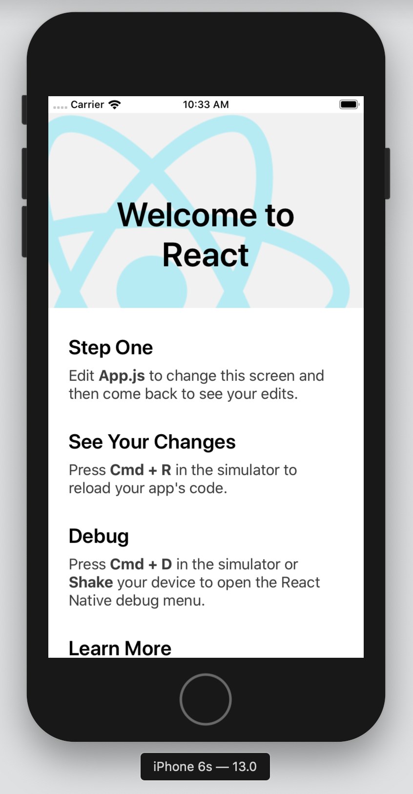

# Local environment

This page will help you configure a local environment for your React Native app.

The usual first step is to install [Homebrew](http://brew.sh/) before configuring your local environment. This guide focuses on OSX operating systems.

## Install Dependencies

### Node and Watchman

[Node](https://nodejs.org/en/) is a JavaScript is an event driven platform for building fast and scalable network apps.

[Watchman](https://facebook.github.io/watchman/) is a file watching service built by Facebook.

`$ brew install node`

`$ brew install watchman`

### CocoaPods and Xcode

The React Native command interface.

`$ sudo gem install cocoapods`

### Xcode

The easiest way to get Xcode is by going to the Apple Store and installing it. This install will take some time so it's best to have a fast Wifi connection.

### Command Line tools

You will also need to install the Xcode Command Line Tools. Open Xcode, then choose "Preferences..." from the Xcode menu. Go to the Locations panel and install the tools by selecting the most recent version in the Command Line Tools dropdown.

### Create a new application

  `$ npx react-native init AwesomeProject` 

### Running the application

`$ npx react-native run-ios`

You should see your new app running in the iOS Simulator shortly.

